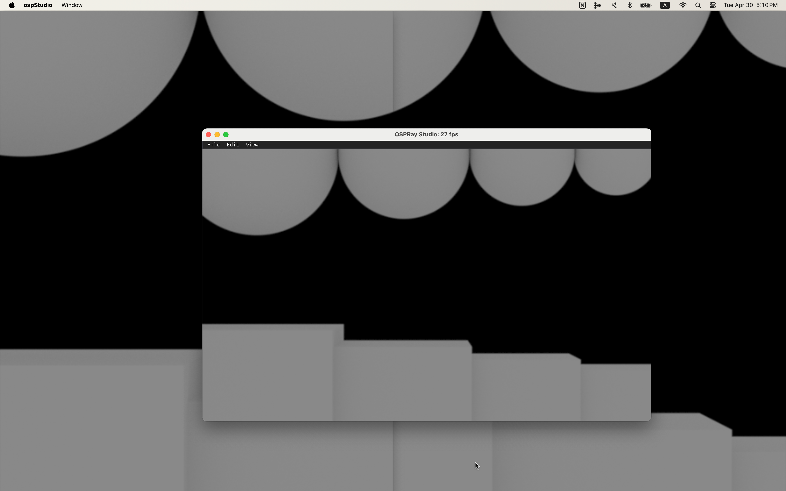

# OSPRay Studio on non-planar displays
> This project is part of a larger project called [Immersive OSPray Studio](https://github.com/jungwhonam/ImmersiveOSPRay).

 ## Overview


We extend [OSPRay Studio v1.0.0](https://github.com/RenderKit/ospray-studio/releases/tag/v1.0.0) to support these additional features:
* Support off-axis projection enabling us to display a single, coherent 3D virtual environemnt on non-planar, tiled-display walls
* Open multiple windows and arrange them based on specifications provided in a JSON file
* Synchronize application states across MPI processes


## Prerequisites
Make the CMake option `BUILD_OSPRAY_MODULE_MPI` is set to `ON` when building OSPRay, as this feature relies on [OSPRay’s MPI module](https://github.com/RenderKit/ospray?tab=readme-ov-file#mpi-distributed-rendering).

## Setup
```shell
# clone this branch
git clone -b jungwho.nam-feature-immersive-latest https://github.com/JungWhoNam/ospray_studio.git
cd ospray_studio

mkdir build
cd build
mkdir release
```

## CMake configuration and build
OSPRay Studio needs to be built with `-DUSE_MPI=ON` in CMake.

Additionally, make sure to use the OSPRay version you have built. After building OSPRay with `BUILD_OSPRAY_MODULE_MPI`, set `ospray_DIR` so CMake can locate OSPRay, e.g., `/Users/jnam/Documents/dev/ospray/build/release/install/ospray/lib/cmake/ospray-3.1.0`.

```shell
cmake -S .. \
-B release \
-DCMAKE_BUILD_TYPE=Release \
-DUSE_MPI=ON \
-Dospray_DIR="/Users/jnam/Documents/dev/ospray/build/release/install/ospray/lib/cmake/ospray-3.1.0"

cmake --build release

cmake --install release
```

## Run `ospStudio` with an example display setting


Run `ospStudio` with 3 ranks. Rank 0 will open a window and handle user inputs, as well as broadcast changes to other processes. Rank 1 and 2 will open windows without decorations such as a border, a close widget, etc. These two windows are placed right next to each other and utilize off-axis projection capabilities to appear as a single window. These specifications are written in the display setting file.

> Download [the example display setting file](./docs/sample//display_settings.json).

> Press 'r' to synchrnoize application states. 

> Press 'q' to quit the application.

```shell
mpirun -n 3 \
./release/ospStudio \
--mpi \
--scene multilevel_hierarchy \
--displayConfig display_settings.json
```

```--mpi```: This option enables the OSPRay Studio's built-in MPI support.

```--scene multilevel_hierarchy```: *(Optional)* this option starts the application with the scene opened.

````--displayConfig display_settings.json````: The JSON configuration file contains information about off-axis projection cameras and windows.

## Support other display settings
Modify the JSON file specificed in the `--displayConfig` flag. Additionally, adjust the number for `mpirun -n` accordingly.

> See [another example display setting file](./docs/sample/rattler.json) for the walls shown in the teaser image.

### Display Configuration JSON File

At the start, the application reads a JSON configuration file to set its cameras and arrange windows. This is a snippet of an example JSON file. 

```
[
    ...

    {
		"hostName": "localhost",
	
		"topLeft": [-0.178950, 0.122950, 1.000000],
		"botLeft": [-0.178950, -0.122950, 1.000000],
		"botRight": [0.178950, -0.122950, 1.000000],
		"eye": [0.000000, 0.000000, 2.000000],
		"mullionLeft": 0.006320,
		"mullionRight": 0.006320,
		"mullionTop": 0.015056,
		"mullionBottom": 0.015056,
	
		"display": 0,
		"screenX": 0,
		"screenY": 0,
		"screenWidth": 1024,
		"screenHeight": 640,
		"decorated": true,
		"showUI": true,
		"scaleRes": 0.250000,
		"scaleResNav": 0.10000,
		"lockAspectRatio": true
	},

    ...
]
```

The JSON configuration file comprises an array of JSON objects. Each object - surrounded by curly brackets - contains information about an off-axis projection camera and the window that shows the camera view.
- ```hostName``` specifies the host responsible for this JSON object. 
- ```topLeft```, ```botLeft```, and ```botRight``` are positions of three corners of a projection plane, i.e., a physical display.
- ```eye``` is the camera position. 
- Four keys that start with ```mullion``` are sizes of mullions on four sides of a display. These values are used to shrink the projection plane, accounting for display frames.  
- ```display``` sets which display to show the window.
- Four keys that start with ```screen``` set the position and size of a window in screen coordinates.

- `decorated` specifies whether the window will have decorations such as a border, a close widget, etc. 
- `showUI` specifies whether the window will have the menu bar.
- `scaleRes` specifies the resolution scale of the rendering. 
- `scaleResNav` specifies the resolution scale when the camera is moving.
- `lockAspectRatio` preserves the relative width and height when you resize the window.

### Example display configuration JSON files
* [the example display setting file](./docs/sample//display_settings.json) for a single display setting shown in the `Run ospStudio with an example display setting` section.
* [another example display setting file](./docs/sample/rattler.json) for the walls shown in the teaser image.

> [!NOTE]
> We provide [this Unity project](https://github.com/JungWhoNam/ConfigurationGenerator) to assist users in creating this JSON file.