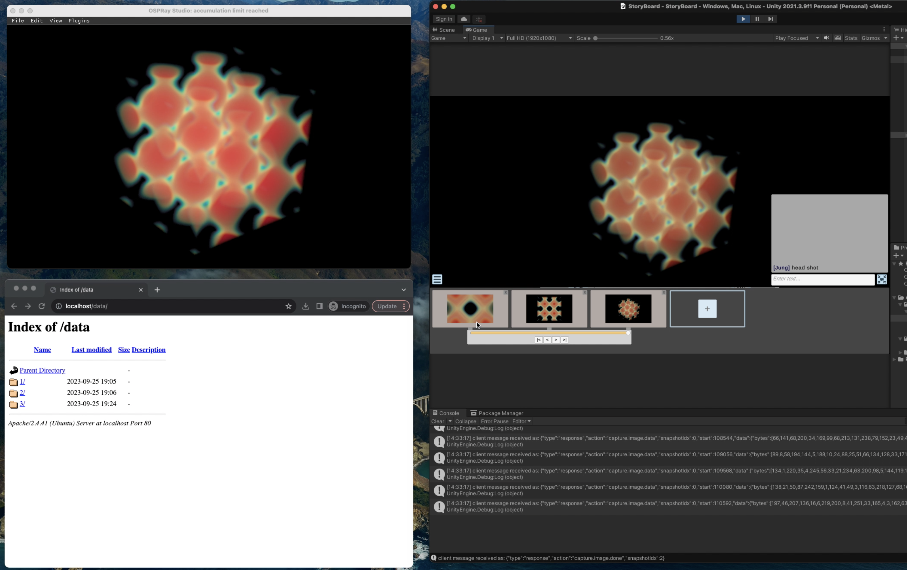

# V-Mail plugin for OSPRay Studio 
> This project is part of a larger project called [Immersive OSPray](https://github.com/jungwhonam/ImmersiveOSPRay) and [Visualization Mail (V-Mail)](https://github.com/JungWhoNam/VisualizationMail).

 ## Overview


We created a plugin for [OSPRay Studio v1.0.0](https://github.com/RenderKit/ospray-studio/releases/tag/v1.0.0) to incorporate [Visualization Mail (V-Mail)](https://github.com/JungWhoNam/VisualizationMail) capabilities. This enables users to create annotated, animated stories directly from OSPRay Studio.

In the above image, you see three applications:
1. Top-left: OSPRay Studio with this plugin (this repo)
2. Bottom-left: [the server](https://github.com/JungWhoNam/VisualizationMailServer) for managing created stories
3. Right: [Unity client](https://github.com/JungWhoNam/Storyboard) for constructing a story 


## Prerequisites
Before running `ospStudio` with the plugin, you need to start both [the server](https://github.com/JungWhoNam/VisualizationMailServer) and [the Unity client](https://github.com/JungWhoNam/Storyboard).


## Setup
```shell
# clone this branch
git clone -b jungwho.nam-feature-plugin-storyboard https://github.com/JungWhoNam/ospray_studio.git
cd ospray_studio

mkdir build
cd build
mkdir release
```


## CMake configuration and build
OSPRay Studio needs to be built with `-DBUILD_PLUGINS=ON` and `-DBUILD_PLUGIN_STORYBOARD=ON` in CMake.

```shell
cmake -S .. \
-B release \
-DCMAKE_BUILD_TYPE=Release \
-DBUILD_PLUGINS=ON \
-DBUILD_PLUGIN_STORYBOARD=ON

cmake --build release

cmake --install release
```


## Run `ospStudio` with the storyboard plugin

1. First, start the server by following the steps written in [the server repo](https://github.com/JungWhoNam/VisualizationMailServer).
2. Start the Unity client by following the steps written in [the client repo](https://github.com/JungWhoNam/Storyboard).
3. Start `ospStudio` with the plugin.
```shell
./release/ospStudio \
--plugin storyboard \
--plugin:storyboard:config storyboard_settings.json
```
4. Go to `Plugins` > `Storyboard Panel` in the menu.
5. Click "Connect" button.

If connected, you will see "Connected to the server successfully" displayed on the Status sub-panel.


## Plugin configuration JSON file
When running `ospStudio`, you must specify the location of this JSON file using `--plugin:storyboard:config` flag. This file contains information about `ipAddress` and `portNumber` of the Unity client.

```json
{
    "ipAddress": "127.0.0.1",
    "portNumber": 8052
}
```

> See [an example JSON file](./storyboard_settings.json).


## Known Issues
Currently, we are only saving camera states. In the future, we plan to capture the entire scene, including material properties, lighting, and more.